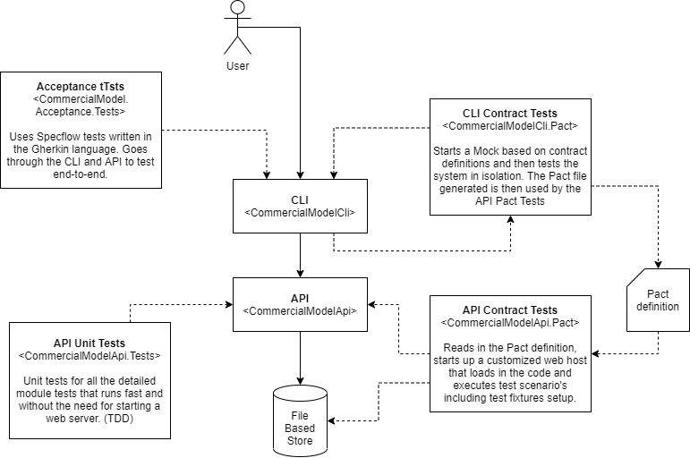

# VS Code C# demonstration project
Dotnet development can be done with Visual Studio or Jetbrains Rider, however, there is another option. VS Code! VS Code does not have all the defaults of a more traditional IDE. You can configure every detail to your own liking. That's really nice if you like being in charge of your own world, but you may want to have a setup that just works for your team.

That's what this project is for, just a little demonstration of how you could work with VS Code to do a non-trivial C# development effort.

## System overview


# Setup your dev environment
This project is developed using WSL2 using an Ubuntu 20.04 virtual environment. You should be able to use this on Mac without much issues and can probably use Windows if you adjust the Pact.io dependencies to match your platform. But maybe you will prefer using either a docker or WSL environment so that your production systems and CI systems can run Docker with a linux based system more easily...

Here's some pointers for the different tools used

## VSCode
This project contains run and launch configurations for VSCode and has been built with the extensions:
- C#
- .NET Core Test Explorer
- Snippets and Syntax Highlight for Gherkin (Cucumber)
- Draw.io integration
- Coverage Gutters
- Remote - WSL

## Installing specflow templates
For acceptance tests, I'm using SpecFlow. There are some templates to make it easier to add new features through the dotnet command.
https://docs.specflow.org/projects/specflow/en/latest/Installation/Installation.html

Check out the recommended plugins and .NET templates.
```
# install templates
dotnet new -i SpecFlow.Templates.DotNet

# add feature
dotnet new specflow-feature
```

## Setup Dev Cert
To make it work in WSL you need linux & windows to trust the dev certificate, here's how to do it. 

Generated certificates are added to the solution root folder:
- localhost.conf
- localhost.crt
- localhost.key
- localhost.pfx

Add the PFX as trusted root certificate
Windows: Install certificate, choose system store, manually select 'Trusted Root Certificate Authorities' for the location
Linux (Ubuntu): copy the crt file to /usr/local/share/ca-certificates and run sudo ca-update-certificates

If you are developing with WSL, do both of the above. Mac is probably similar to Linux, but great if someone can help documenting that.

**TODO: Unfortunately I have not found a way yet to reference the certificate without using the full path from the API project. Make sure to adjust the path in CommercialModelApi/appsettings.Development.json**
(You might normally place the dev cert in a well known location such as ~/dev-cert/localhost.pfx and have everyone use the same path reference.)

# Working with the project
## Run tests
This is how you run the different test scenario's

Run all:
```dotnet test```

Run unit:
```dotnet test CommercialModelApi.Tests```

Run pact:
```
# this makes the pact file you need for the other test
dotnet test CommercialModelCli.Pact

# this uses the pact file made by the CLI Consumer test
dotnet test CommercialModelApi.Pact
```

Run acceptance:
```dotnet test CommercialModel.Acceptance.Tests```

## Update API definition in Cli project
If you update the API, you need to copy the updated spec (downloadable via SwaggerUI after starting the API project) to the `CommercialModelCli/CommercialModelApi.json` file. 

The project file has a reference that will automatically update the library code on every build. So after updating the file make sure to run a build before updating the code.

## Adding a project to the solution
This project is setup as a .NET core project with solution. To add a project you can do:

```
# Add the project
dotnet new <projecttype> -o <projectname>

# Add the project to the solution
dotnet sln add <projectname>
```

## Keep tests continuously running in VSCode
You can use the task watch-api-unit-tests to continuously run unit tests.

[ctrl-shift-p] > Tasks: Run Test Task

You can also continuously run acceptance tests. This can be useful to track every change as it is made and speed up your testing workflow.

[ctrl-shift-p] > Tasks: Run Task > watch-acceptance-tests

## Restart webservice automatically and keep running in VSCode
Use the task watch-api to keep the webserver continuously running. This helps with acceptance testing.

[ctrl-shift-p] > Tasks: Run Task > watch-api